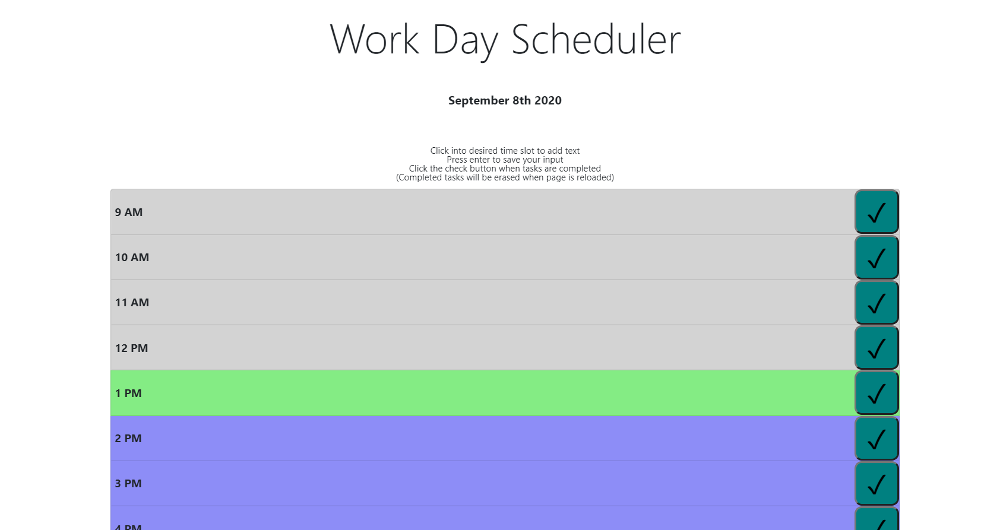

# Work Day Scheduler

This application allows a user to create a daily schedule. 
Tasks to be completed can be listed for every hour of the work day. 
If the hour is upcoming, the row will be in blue.  if the hour is the same as the current time's hour, it will be in green.  for everything in the past, it will be in gray. 
Once a task is completed the check button on the right will put a red line through that hour's task,  and once the page is reloaded that hour will be cleared.

### Link to page

[Day Scheduler](https://tniles320.github.io/day-scheduler/)